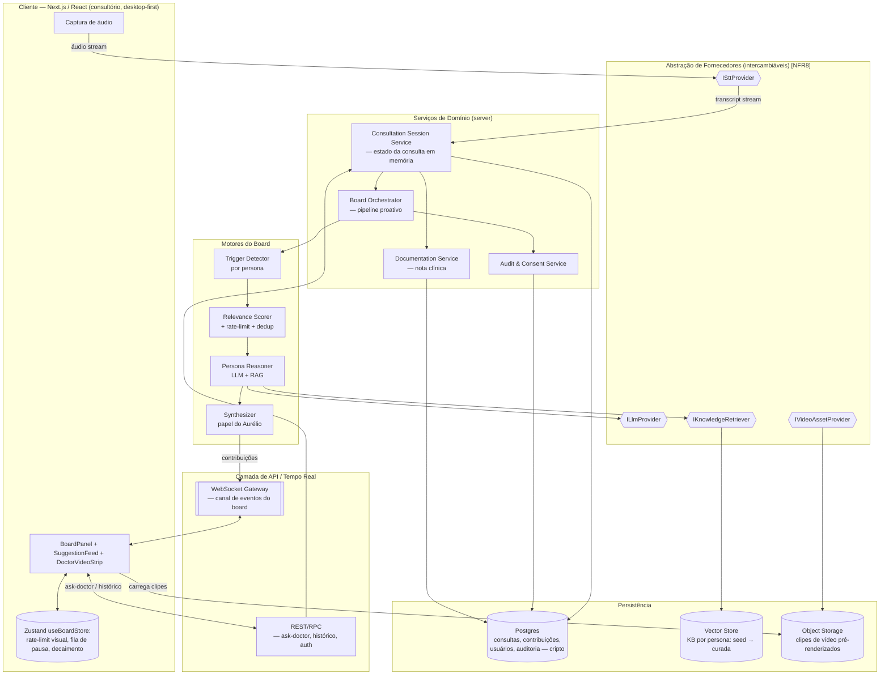
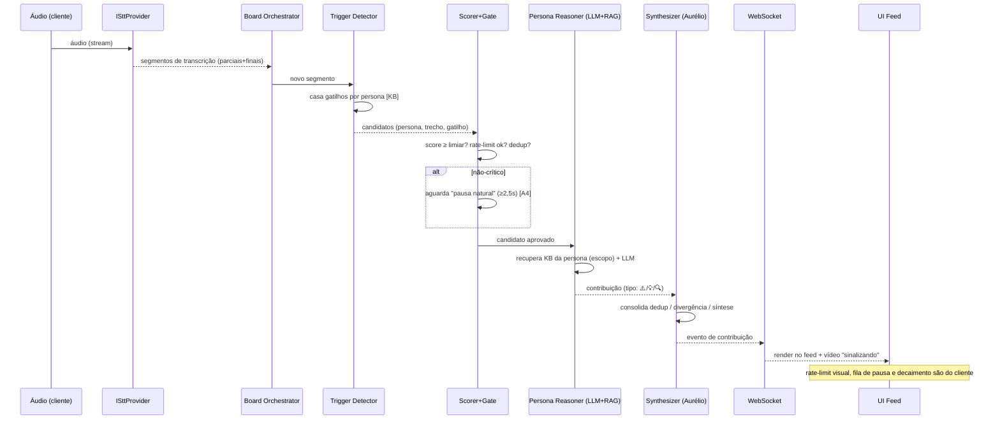
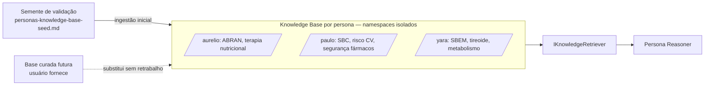
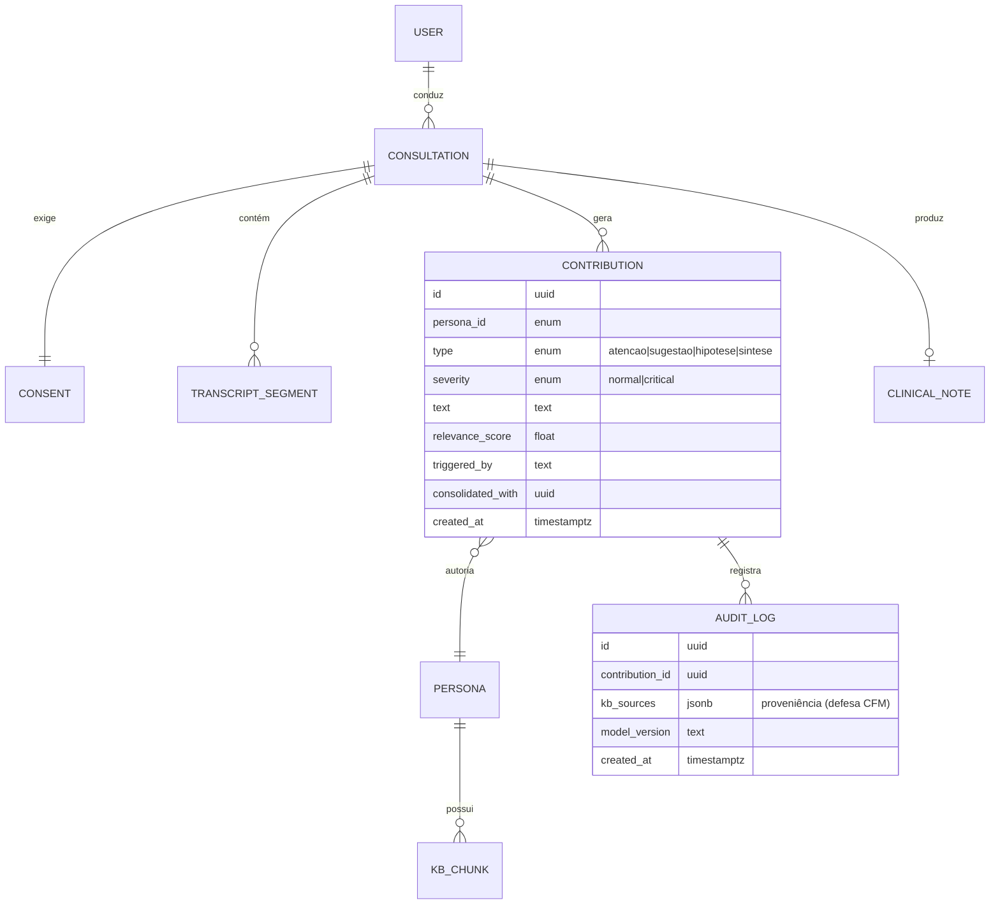

# NutriMed — Board de Especialistas de IA — Architecture Document

> **Autor:** Aria (@architect) · **Data:** 2026-06-09 · **Status:** Draft v1.0
> **Handoff de:** Morgan (@pm) · **Fontes:** `docs/prd.md` (FR/NFR), `docs/frontend-spec.md`, `docs/personas-board.md`, `docs/personas-knowledge-base-seed.md`, `docs/market-research.md`
> **Princípio:** Article IV (No Invention) — decisões derivam dos FR/NFR ou são registradas como ADR/suposição.

---

## 1. Avaliação de Complexidade

Método AIOX — 5 dimensões (1 = trivial, 5 = crítico).

| Dimensão | Score | Justificativa |
|---|:--:|---|
| **Scope** (arquivos/módulos afetados) | **5** | Pipeline de tempo real, orquestração multi-agente, RAG, geração de vídeo, frontend reativo, camada de compliance — muitos subsistemas independentes. |
| **Integration** (APIs externas) | **5** | 3 classes de fornecedor intercambiáveis (STT streaming PT-BR, LLM, geração de vídeo) + vector store. Cada uma é ponto de falha e de custo. `[NFR8]` |
| **Infrastructure** (mudanças de infra) | **4** | Streaming bidirecional de baixa latência, armazenamento criptografado de dados de saúde (LGPD), vector DB, observabilidade de custo. |
| **Knowledge** (familiaridade) | **4** | Board proativo multi-persona com gatilhos/score/dedup é padrão novo, sem precedente direto no mercado; greenfield. |
| **Risk** (criticidade) | **5** | Dados sensíveis de saúde + postura regulatória CFM + segurança clínica (um ⚠️ perdido tem custo assimétrico). `[R1][R2][R3]` |

**Score total: 23/25 → Classe COMPLEX** (≥ 16).

**Implicações:**
- Exige Spec Pipeline completo + ciclo de revisão antes de stories pesadas.
- Compliance e abstração de fornecedores são **fundação**, não feature tardia.
- Recomenda-se um **walking skeleton** (transcrição → 1 persona → 1 sugestão no feed) antes de ampliar para as 3 personas e os guarda-corpos.

---

## 2. Visão de Arquitetura (alto nível)



---

## 3. Decomposição em Módulos

| Módulo | Responsabilidade | FR/NFR |
|---|---|---|
| **Consultation Session Service** | Ciclo de vida da consulta; mantém o estado da sessão (transcript acumulado, contribuições, doutores silenciados, Modo Foco); orquestra start/stop. | FR1, FR20 |
| **Board Orchestrator** | Coordena o pipeline proativo das 3 personas sobre o stream de transcrição. | FR2–FR7 |
| **Trigger Detector** | Detecta, por persona, gatilhos clínicos na transcrição (ver `[KB]`). | FR3, FR4, FR5, FR21 |
| **Relevance Scorer + Gate** | Score de confiança/relevância (limiar), rate-limit por doutor, deduplicação, gating por "pausa natural". | NFR1, NFR2, FR11, FR12 |
| **Persona Reasoner** | Gera a contribuição em texto via LLM, com contexto RAG restrito ao escopo da persona. | FR3, FR21 |
| **Synthesizer (Aurélio)** | Consolida divergências/redundâncias e produz a síntese; expõe divergência transparente. | FR6, FR7, FR11, FR18 |
| **Documentation Service** | Gera transcrição estruturada + nota clínica editável. | FR17 |
| **Audit & Consent Service** | Consentimento de gravação; trilha de auditoria de toda contribuição (defesa CFM). | FR19, FR20, NFR9, NFR10 |
| **Provider Abstraction Layer** | Interfaces desacopladas para STT/LLM/Vídeo/Retriever. | NFR8 |
| **Video Asset Catalog** | Mapeia (persona × estado) → clipe pré-renderizado; pipeline de geração offline. | FR9, FR10, NFR6, NFR7 |
| **Real-Time Transport** | Canal WebSocket de eventos do board; REST para request/response. | FR9, NFR5 |

---

## 4. O Pipeline de Tempo Real (coração do sistema)



**Divisão de responsabilidade dos guarda-corpos** (decisão de arquitetura, alinhada à `frontend-spec` §11.2):
- **Servidor:** score de relevância, rate-limit lógico (fonte de verdade), deduplicação/consolidação, classificação do tipo. → garante consistência e auditabilidade.
- **Cliente:** decaimento visual, fila de pausa de apresentação, animações. → comportamento de UI.

**⚠️ críticos furam a fila e o gating de pausa** (NFR4 / frontend-spec): o orchestrator marca `severity=critical` e o transport entrega imediatamente com `aria-live=assertive`.

---

## 5. Camada de Abstração de Fornecedores (NFR8)

Núcleo da estratégia contra Supplier Power ALTO e contra o custo. Todo provider externo fica atrás de uma interface; trocar fornecedor = nova implementação, sem tocar no domínio.

```typescript
// Contratos (ilustrativos — Article IV: derivam de NFR8/NFR5/NFR7)

interface ISttProvider {
  // streaming PT-BR; emite segmentos parciais e finais
  openStream(opts: { lang: 'pt-BR' }): SttSession; // -> AsyncIterable<TranscriptSegment>
}

interface ILlmProvider {
  complete(req: { system: string; context: KbChunk[]; transcript: string }):
    Promise<PersonaContribution>;
}

interface IKnowledgeRetriever {
  // recupera SÓ dentro do namespace da persona (FR21)
  retrieve(personaId: PersonaId, query: string, k: number): Promise<KbChunk[]>;
}

interface IVideoAssetProvider {
  // MVP: catálogo pré-renderizado (NÃO streaming em tempo real) [NFR7]
  getClip(personaId: PersonaId, state: VideoState): ClipRef; // ouvindo|pensando|sinalizando
}
```

> **Por quê:** isola o risco de fornecedor (preço/disponibilidade), permite A/B de qualidade, e prepara a Fase 2 (TTS) e Fase 3 (avatar interativo) como novas implementações de interface — sem refatorar o domínio.

---

## 6. Base de Conhecimento (o fosso) — RAG



- **Namespaces por persona (FR21):** cada doutor só recupera da sua especialidade — impede o cardiologista de "inventar" endocrinologia.
- **Seed → Curada sem retrabalho (R8):** pipeline de ingestão versionado; trocar conteúdo é re-ingestão, não mudança de código.
- **Versionamento e proveniência:** cada chunk guarda fonte/versão (defesa de auditoria + qualidade clínica).
- **Decisão de escopo:** o motor de RAG é fundação; a *qualidade* do conteúdo (o fosso real) é trabalho de curadoria clínica, fora da engenharia.

---

## 7. Transporte em Tempo Real — decisão

**Decisão: WebSocket** para o canal de eventos do board (ver ADR-003).

| Critério | WebSocket (escolhido) | SSE + REST |
|---|---|---|
| Push de contribuições servidor→cliente | ✅ | ✅ |
| Sinais cliente→servidor (silenciar, Modo Foco, ask-doctor em fluxo) | ✅ nativo | ⚠️ precisa de canal REST paralelo |
| Reconexão/resiliência | requer heartbeat próprio | nativa (event id) |
| Complexidade | média | baixa |

O áudio para STT geralmente usa o SDK/stream do próprio provider (não trafega pelo WS do board). O WS carrega **eventos do board** (contribuições, mudanças de estado de vídeo) e **comandos** (silenciar/foco/perguntar). REST/React Query para histórico e operações request/response.

---

## 8. Modelo de Dados (alto nível)



- **Criptografia:** dados de saúde em repouso e em trânsito (NFR9). Considerar residência de dados no Brasil (LGPD).
- **Auditabilidade (NFR10):** toda contribuição rastreia gatilho, fontes de KB e versão de modelo — sustenta "IA assiste, médico decide".

---

## 9. Stack Tecnológica (proposta)

> Alinhada ao preset ativo do projeto (Next.js/React/TS/Tailwind/shadcn/Zustand/React Query — frontend-spec §11).

| Camada | Escolha proposta | Observação |
|---|---|---|
| Frontend | Next.js 16+ / React / TS / Tailwind / shadcn / Zustand / React Query | Já assumido na frontend-spec |
| Backend | Node/TS (mesmo monorepo) — serviços de domínio + WS gateway | Coerência de linguagem; reaproveita tipos |
| Tempo real | WebSocket (board) + provider SDK (STT) | ADR-003 |
| Dados | Postgres (relacional + cripto) + Vector Store (RAG) + Object Storage (clipes) | — |
| Fornecedores IA | atrás de `ISttProvider`/`ILlmProvider`/`IVideoAssetProvider`/`IKnowledgeRetriever` | NFR8 — **escolha específica de vendor é decisão de POC**, não amarrada na arquitetura |
| Infra | Serverless/modular onde couber; serviço de sessão pode exigir processo stateful | A validar na POC de latência |

> **Suposição A6 (do PRD) confirmada como direção:** monorepo + RAG. **Serverless puro** tem ressalva: o **Board Orchestrator é stateful por sessão** (acumula transcript/contexto) e o **WS** precisa de conexões persistentes — isso favorece um serviço long-lived para a sessão, com o resto serverless. Decidir na POC.

---

## 10. ADRs (Architecture Decision Records)

| ADR | Decisão | Status |
|---|---|---|
| **ADR-001** | Monorepo full-stack TypeScript (Next.js + serviços Node) | Aceito (preset) |
| **ADR-002** | Camada de abstração de fornecedores para STT/LLM/Vídeo/Retriever | Aceito (NFR8) |
| **ADR-003** | WebSocket como canal de eventos do board; REST para request/response | Aceito |
| **ADR-004** | RAG com vector store, namespaces isolados por persona; seed→curada por re-ingestão | Aceito (FR21, R8) |
| **ADR-005** | Board Orchestrator como serviço stateful por sessão (não 100% serverless) | Proposto — validar na POC |
| **ADR-006** | Compliance-by-design: cripto, auditoria, consentimento, residência BR desde o dia 1 | Aceito (NFR9, NFR10) |
| **ADR-007** | Vídeo das personas = catálogo pré-renderizado (não avatar em tempo real no MVP) | Aceito (NFR7) |
| **ADR-008** | Guarda-corpos: lógica (score/rate/dedup) no servidor; apresentação (decaimento/fila/pausa) no cliente | Aceito |

---

## 11. Considerações de NFR

### Latência (NFR5) — orçamento alvo (suposição, validar)
`fala → STT (~1–2s) → trigger+score (<200ms) → LLM+RAG (~1–2s) → transport (<200ms) → render`
**Alvo total: ~3–4s** para não-críticos. ⚠️ críticos devem priorizar o caminho (fura fila/pausa). Se o LLM dominar a latência, considerar modelo mais rápido para classificação/trigger e modelo mais forte só para a contribuição.

### Custo unitário (NFR7) — controles
- Vídeo pré-renderizado (custo único de produção, zero por consulta). `[ADR-007]`
- Trigger barato (regra/embedding) **antes** de chamar o LLM — não acionar LLM em todo segmento.
- Rate-limit reduz chamadas de LLM.
- Modularidade permite escolher o tier de modelo certo por tarefa. `[NFR8]`
- Instrumentar **custo por consulta** como métrica de primeira classe.

### LGPD / CFM (NFR9, NFR10) — by design
- Criptografia em repouso/trânsito; minimização; consentimento explícito (FR20); trilha de auditoria com proveniência (defesa de "apoio à decisão").
- Disclaimers persistentes na UI (FR19).
- **Item para consultoria jurídica** (R1): retenção de áudio/transcrição, base legal de tratamento, residência de dados.

### Escalabilidade
- Sessões são isoladas; escala horizontal por consulta concorrente. Gargalos prováveis: conexões WS e throughput de LLM — dimensionar por fornecedor.

---

## 12. Riscos Técnicos

| # | Risco técnico | Mitigação |
|---|---|---|
| T1 | **Latência do board** torna sugestões inúteis (chegam tarde). | Trigger barato antes do LLM; modelo rápido p/ classificação; medir orçamento §11; ⚠️ priorizado. |
| T2 | **Custo de LLM** explode com board sempre ativo. | Gating agressivo (trigger+score+rate-limit) antes do LLM; instrumentação de custo/consulta. |
| T3 | **Dependência de fornecedor** (preço/quebra de API). | Abstração NFR8 (ADR-002); ≥2 candidatos por classe na POC. |
| T4 | **STT PT-BR** impreciso com jargão médico/sotaque → gatilhos falham. | Avaliar STT na POC com áudio clínico real; vocabulário/boost de termos; lidar com parciais. |
| T5 | **Qualidade do vídeo IA** (uncanny valley) prejudica credibilidade. | Loops curtos/estáveis (NFR6); fallback estático; é custo único, dá p/ iterar. |
| T6 | **RAG alucina/extrapola** especialidade. | Namespaces por persona (FR21); proveniência; prompts restritos; revisão clínica da curadoria. |
| T7 | **Compliance** mal feito = risco legal grave. | By design (ADR-006); consultoria jurídica antes de dados reais (R1/R2). |
| T8 | **Estado de sessão** (orchestrator stateful) complica escala/serverless. | ADR-005; POC define o modelo de runtime. |

---

## 13. Particionamento Técnico em Épicos (proposta para @pm)

Ordem por dependência; começa pelo walking skeleton.

| Épico | Tema | Entrega | Depende de |
|---|---|---|---|
| **E1** | Fundação & Compliance | Monorepo, auth, consentimento (FR20), cripto, auditoria (NFR9/10), CI | — |
| **E2** | Pipeline de Transcrição | `ISttProvider` + stream PT-BR + display (FR1) | E1 |
| **E3** | Walking Skeleton do Board | 1 persona, 1 gatilho → 1 contribuição no feed via WS | E2 |
| **E4** | Motores do Board | Trigger Detector + Scorer/Gate + rate-limit + dedup (FR3–5, FR11–12, NFR1–2) | E3 |
| **E5** | RAG & Persona Reasoner | `IKnowledgeRetriever` + ingestão da semente + raciocínio escopado (FR21, R8) | E3 |
| **E6** | Board completo + Synthesizer | 3 personas, divergência transparente, síntese do Aurélio (FR2, FR6–7, FR18) | E4, E5 |
| **E7** | UI do Board | Painel lateral, 4 tipos, controles, Modo Foco, a11y (FR8–10, FR13–16, FR19, NFR3–4) | E3 (incremental) |
| **E8** | Vídeo das Personas | `IVideoAssetProvider` + catálogo + estados/coreografia (FR9–10, NFR6–7) | E7 |
| **E9** | Documentação Clínica | Nota clínica editável (FR17) | E2 |
| **E10** | Observabilidade & Piloto | Custo/consulta, métricas de ruído (silenciar/Modo Foco), telemetria de calibração | E6, E7 |

---

## 14. Resumo Executivo

- **Complexidade: COMPLEX (23/25)** — exige fundação de compliance + abstração de fornecedores antes de features, e um walking skeleton antes de ampliar.
- **Módulos centrais:** Consultation Session, Board Orchestrator (Trigger → Scorer/Gate → Reasoner → Synthesizer), Provider Abstraction Layer, RAG por persona, Real-Time Transport (WebSocket), Audit/Consent.
- **5 decisões arquiteturais mais importantes:**
  1. **Abstração de fornecedores (ADR-002)** — o seguro contra custo e lock-in (NFR8) e a ponte para Fases 2/3.
  2. **Gating antes do LLM (ADR-008)** — trigger barato + score + rate-limit controlam custo (T2) e ruído.
  3. **WebSocket (ADR-003)** para o canal bidirecional do board.
  4. **RAG por namespace de persona (ADR-004)** — sustenta FR21 e a substituição seed→curada sem retrabalho.
  5. **Compliance-by-design (ADR-006)** — inegociável dado R1/R2.
- **Maiores riscos técnicos:** latência do board (T1), custo de LLM (T2), precisão do STT PT-BR clínico (T4) e compliance (T7).
- **Recomendação:** rodar uma **POC de latência/custo** com 2 candidatos de STT e de LLM (E2+E3) **antes** de comprometer a stack — é o que valida ADR-005 e os orçamentos da §11.

---

*Documento gerado por Aria (@architect) — AIOX. Próximo: `@pm *create-epic` para formalizar E1–E10; POC de latência/custo recomendada antes de stories pesadas.*
