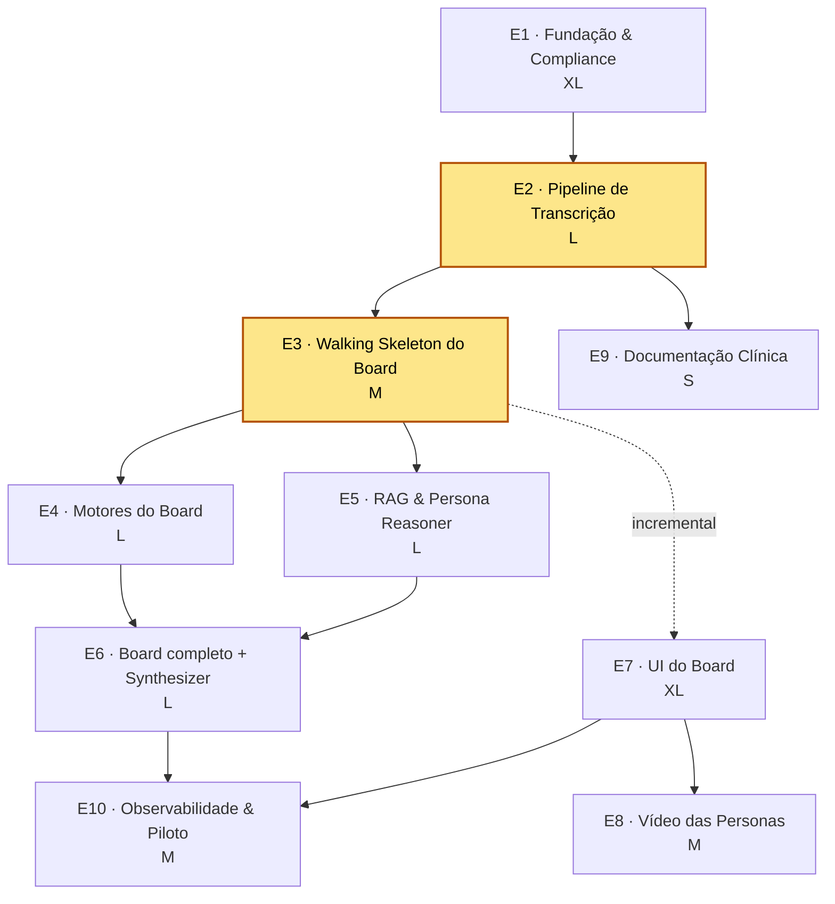

# NutriMed — Backlog de Épicos (E1–E10)

> **Autor:** Morgan (@pm / Strategist) · **Data:** 2026-06-09 · **Status:** Draft v1.0
> **Comando:** `*create-epic` · **Fonte do particionamento:** `docs/architecture.md` §13 (Aria @architect)
> **Rastreabilidade (Article IV — No Invention):** cada épico rastreia FR1–FR21 / NFR1–NFR12 de `docs/prd.md` e ADRs de `docs/architecture.md`. Itens não derivados das fontes estão marcados `[ASSUMPTION]`.
> **Handoff de origem:** Aria (@architect) → Morgan (@pm). **Próximo:** @sm `*draft` por story; @po `*validate-story-draft`.

---

## 1. Contexto

NutriMed é um **board virtual de 3 especialistas de IA humanizados** (Dr. Aurélio Bastos / nutrologia, Dr. Paulo Tavares / cardiologia, Dra. Yara Nakamura / endocrinologia) que acompanham a consulta do nutrólogo **ao vivo via transcrição em tempo real**, sugerindo proativamente por **texto**. O MVP é deliberadamente enxuto: **apenas texto, board sempre ativo, vídeo das personas pré-renderizado por IA, painel lateral fixo**.

A arquitetura avaliou a complexidade como **COMPLEX (23/25)**, exigindo:
- **Fundação de compliance + abstração de fornecedores** ANTES de features.
- Um **walking skeleton** (transcrição → 1 persona → 1 sugestão no feed) antes de ampliar para as 3 personas e os guarda-corpos.
- Uma **POC de latência/custo** (E2 + E3) antes de comprometer a stack.

---

## 2. Lista dos 10 Épicos (ordem recomendada por dependência)

| # | ID | Épico | Tamanho (T-shirt) | Depende de | Arquivo |
|---|----|-------|:-----------------:|------------|---------|
| 1 | **E1** | Fundação & Compliance | **XL** | — | [epic-01-fundacao-compliance.md](epic-01-fundacao-compliance.md) |
| 2 | **E2** | Pipeline de Transcrição | **L** | E1 | [epic-02-pipeline-transcricao.md](epic-02-pipeline-transcricao.md) |
| 3 | **E3** | Walking Skeleton do Board | **M** | E2 | [epic-03-walking-skeleton-board.md](epic-03-walking-skeleton-board.md) |
| 4 | **E4** | Motores do Board | **L** | E3 | [epic-04-motores-board.md](epic-04-motores-board.md) |
| 5 | **E5** | RAG & Persona Reasoner | **L** | E3 | [epic-05-rag-persona-reasoner.md](epic-05-rag-persona-reasoner.md) |
| 6 | **E6** | Board completo + Synthesizer | **L** | E4, E5 | [epic-06-board-completo-synthesizer.md](epic-06-board-completo-synthesizer.md) |
| 7 | **E7** | UI do Board | **XL** | E3 (incremental) | [epic-07-ui-board.md](epic-07-ui-board.md) |
| 8 | **E8** | Vídeo das Personas | **M** | E7 | [epic-08-video-personas.md](epic-08-video-personas.md) |
| 9 | **E9** | Documentação Clínica | **S** | E2 | [epic-09-documentacao-clinica.md](epic-09-documentacao-clinica.md) |
| 10 | **E10** | Observabilidade & Piloto | **M** | E6, E7 | [epic-10-observabilidade-piloto.md](epic-10-observabilidade-piloto.md) |

**Legenda T-shirt:** S = 1–3 stories · M = 3–5 stories · L = 5–8 stories · XL = 8+ stories. (Estimativa relativa, não compromisso de prazo; calibrar com @sm ao detalhar stories.)

---

## 3. Grafo de Dependências

> **Destaque (âmbar):** **E2 + E3 são a POC de latência/custo** recomendada pela arquitetura (§14) — devem ser executados antes de stories pesadas para validar ADR-005 (orchestrator stateful) e os orçamentos de latência da §11.

---

## 4. Épico recomendado para começar

**Comece por E1 (Fundação & Compliance).** Justificativa estratégica:

1. **Compliance é fundação, não feature tardia** (`ADR-006`, `R1`, `R2`, `NFR9`, `NFR10`). Dados sensíveis de saúde + postura CFM/LGPD têm custo de erro assimétrico — retrofit é caro e arriscado.
2. **A abstração de fornecedores (`NFR8` / `ADR-002`) é a espinha dorsal** sobre a qual E2 (STT), E5 (LLM/RAG) e E8 (vídeo) se conectam. Sem ela, cada épico de integração vira lock-in.
3. **Desbloqueia tudo:** E1 é o único épico sem predecessores; nenhuma story de valor pode ser feita com segurança antes dele.

**Sequência crítica recomendada (caminho da POC):** **E1 → E2 → E3** (POC de latência/custo), com **E7 começando incrementalmente em paralelo a partir de E3** (a UI evolui junto com o backend). Depois E4 e E5 em paralelo (ambos dependem só de E3), convergindo em E6.

---

## 5. Marcação da POC de Latência/Custo (recomendação da arquitetura §14)

| Pré-requisito da POC | Por quê |
|---|---|
| **E2 — Pipeline de Transcrição** | Valida STT PT-BR streaming com ≥ 2 candidatos de fornecedor sobre áudio clínico real (risco `T4`); mede a latência fala→texto (`NFR5`). |
| **E3 — Walking Skeleton do Board** | Fecha o loop fim-a-fim (transcrição → 1 persona → 1 contribuição no feed via WS); valida `ADR-005` (orchestrator stateful) e o orçamento total de latência (~3–4s, §11) com ≥ 2 candidatos de LLM. |

**Objetivo da POC:** decidir a stack de runtime e os fornecedores **antes** de comprometer E4/E5/E6 (que são caros). Se a latência/custo não fechar, a arquitetura é replanejada com baixo custo afundado.

---

## 6. Trilhas transversais (não são épicos sequenciais)

Herdadas do PRD §11. Acontecem em paralelo, fora da sequência E1→E10:

- **Base de conhecimento curada (o fosso):** curadoria clínica por especialidade — trabalho de conteúdo, não de engenharia. A engenharia (E5) entrega o pipeline; o conteúdo curado **substitui a semente por re-ingestão** (`ADR-004`, `R8`). `[O1]`
- **Compliance & regulatório:** consultoria CFM/LGPD contínua desde E1. `[R1][R2]` — ver [ADR-009 Residência de Dados BR](../architecture/project-decisions/adr-009-residencia-dados-br.md) e o [Checklist de Consultoria Jurídica](../architecture/project-decisions/checklist-consultoria-juridica.md) (itens CJ-1…CJ-6 **bloqueantes para o piloto real**, Story 1.8).
- **Calibração de ruído:** ajustar limiar de relevância e rate-limit com dados reais — alimentada por E10. `[O2][O3]`

---

## 7. Fora do escopo deste backlog (MVP)

Conforme PRD §5 (OUT): Voz/TTS (Fase 2), avatar interativo em tempo real (Fase 3), base curada definitiva, modo paciente-visível, B2B/Segment 3, integração com EHR de terceiros `[A2]`, módulo de Composição Corporal por Foto (`docs/prd-body-composition-mvp.md` — épico próprio, não priorizado aqui).

---

## 8. Cobertura de Requisitos (matriz épico × FR/NFR)

| Requisito | Épico(s) |
|---|---|
| FR1 (transcrição PT-BR) | E2 |
| FR2 (3 personas ativas) | E3 (1), E6 (3) |
| FR3 (contribuições proativas) | E4, E5 |
| FR4 (alerta CV — Paulo) | E4, E5, E6 |
| FR5 (hipótese hormonal — Yara) | E4, E5, E6 |
| FR6 (Aurélio abre/sintetiza) | E6 |
| FR7 (divergência transparente) | E6, E7 |
| FR8 (4 tipos de contribuição) | E7 |
| FR9 (painel: vídeos + feed) | E7, E8 |
| FR10 (estados de vídeo) | E8 |
| FR11 (dedup/consolidação) | E4, E6 |
| FR12 (surgir em pausas) | E4, E7 |
| FR13 (silenciar doutor) | E7 |
| FR14 (expandir/perguntar) | E7 |
| FR15 (dispensar/fixar) | E7 |
| FR16 (Modo Foco) | E7 |
| FR17 (documentação clínica) | E9 |
| FR18 (síntese sob demanda) | E6 |
| FR19 (disclaimers) | E1, E7 |
| FR20 (consentimento) | E1 |
| FR21 (escopo por persona) | E5 |
| NFR1 (score relevância) | E4 |
| NFR2 (rate limit) | E4 |
| NFR3 (decaimento visual) | E7 |
| NFR4 (hierarquia de segurança) | E7 |
| NFR5 (latência) | E2, E3 (POC) |
| NFR6 (qualidade de vídeo) | E8 |
| NFR7 (custo unitário / vídeo pré-render) | E8, E10 |
| NFR8 (modularidade de fornecedores) | E1, E2, E5, E8 |
| NFR9 (LGPD/cripto/auditoria) | E1 |
| NFR10 (postura CFM/auditoria) | E1, E6 |
| NFR11 (idioma PT-BR) | E2, E5, E7 |
| NFR12 (confiabilidade de demo) | E3, E6, E10 |

> Todo FR/NFR do PRD está coberto por ≥ 1 épico. Nenhum requisito órfão.

---

*Backlog gerado por Morgan (@pm / Strategist) — AIOX. Particionamento derivado de `docs/architecture.md` §13. Próximo passo: @sm `*draft` por story (começando por E1), @po `*validate-story-draft`.*
