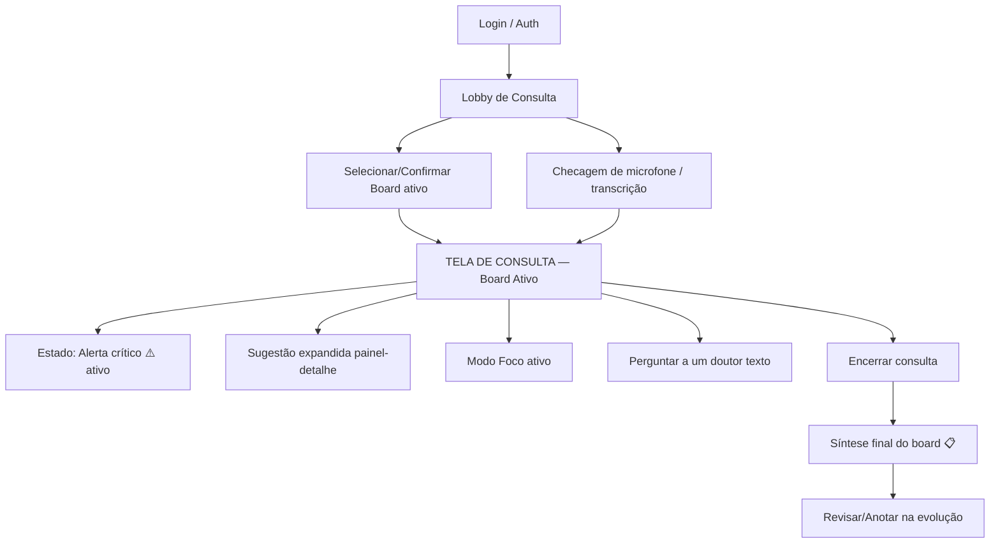
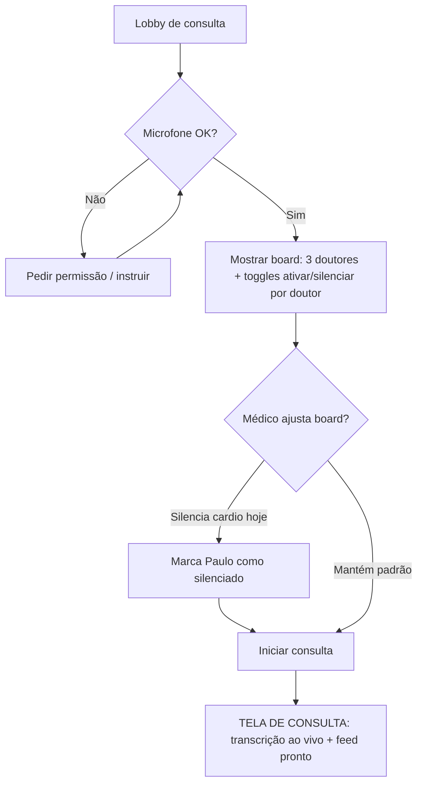
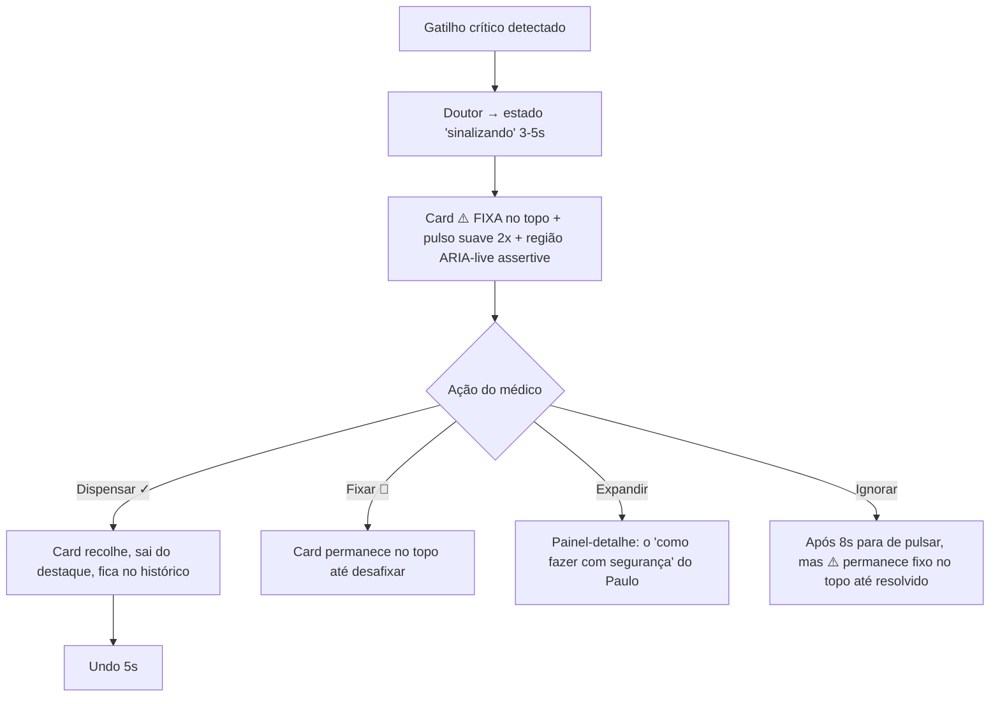
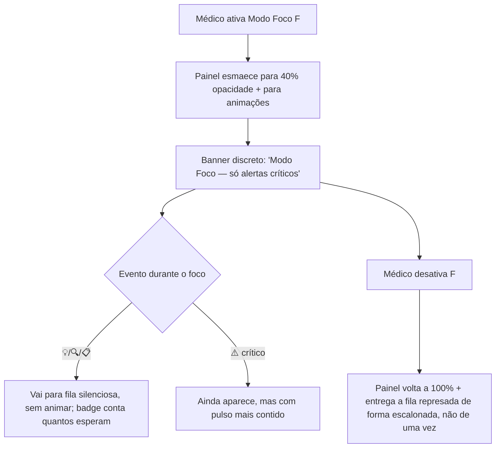
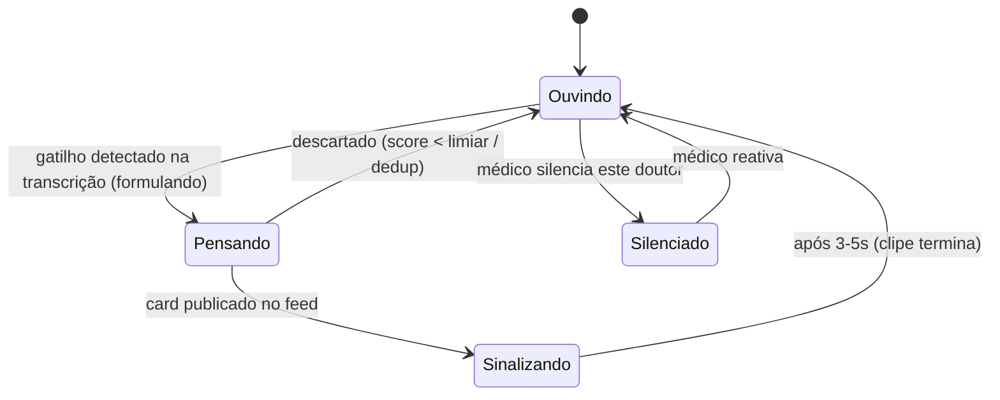

# NutriMed — Board de Especialistas em Tempo Real — UI/UX Specification

> **Autor:** Uma (UX/UI Designer & Design System Architect) · **Data:** 2026-06-08 · **Status:** Draft v1.0
> **Handoff de:** Atlas (Business Analyst)
> **Escopo deste documento:** A **tela de consulta com o Board Ativo** (3 especialistas de IA acompanhando a consulta ao vivo via transcrição). Detalha e expande `docs/board-ux-design.md`.
> **Relacionado:** `docs/board-ux-design.md` (fonte principal) · `docs/personas-board.md` · `docs/personas-knowledge-base-seed.md` · `docs/market-research.md`
> **Stack-alvo (preset ativo):** Next.js 16+ / React / TypeScript / Tailwind CSS / shadcn/ui / Zustand / React Query

---

## ⚠️ Nota de escopo (leia primeiro)

Existem **dois produtos/módulos distintos** sob o guarda-chuva NutriMed:

1. **O Board de Especialistas em tempo real durante a consulta** — núcleo da plataforma; foco DESTE documento.
2. **O Módulo de Composição Corporal por Foto** — coberto por `docs/prd-body-composition-mvp.md` (módulo entre-consultas; spec própria a ser feita quando aquele épico for priorizado).

Este `frontend-spec.md` cobre **exclusivamente o item 1** (o board em tempo real), conforme o handoff do Atlas. Quando o módulo de composição corporal entrar em design, recomendo um `frontend-spec-body-composition.md` separado para não misturar contextos de uso (consultório ao vivo vs. captura mobile do paciente).

---

## Suposições explícitas (modo autônomo / YOLO)

Como trabalhei sem rodadas de elicitação, registro aqui cada decisão tomada para destravar o design. Todas são reversíveis e marcadas para validação.

| # | Suposição | Razão | Risco se errada |
|---|---|---|---|
| **A1** | Identidade visual NutriMed ainda não existe → defino uma paleta-base "clínica-confiável" (verde-petróleo + neutros) como ponto de partida. | PRD diz "herdar identidade NutriMed", mas nenhum style guide foi entregue. | Baixo — tokens são parametrizados; trocar a cor-marca é mudar 2 variáveis. |
| **A2** | Plataforma de uso é **desktop em primeiro lugar** (médico no consultório, monitor 1080p+). Tablet é secundário. Celular fora de escopo para a tela de consulta. | O nutrólogo conduz a consulta presencialmente; precisa de tela ampla para transcrição + board. (O PRD trata mobile só para o módulo de captura do paciente, que é outro contexto.) | Médio — se houver uso em tablet retrato real, o painel lateral precisará virar gaveta. Mitigado na seção de Responsividade. |
| **A3** | A transcrição ao vivo (speech-to-text) já é provida por um serviço a montante; o board consome o texto. O design não cobre a UI de captura de áudio em si, apenas o display da transcrição. | Decisão de produto: board é "só texto" no MVP; transcrição é input, não feature de UI desta tela. | Baixo. |
| **A4** | "Pausa natural" (guarda-corpo #4) é definida como **≥ 2,5 s sem nova fala transcrita** OU fim de turno detectado. Configurável. | Atlas deixou em aberto; preciso de um número para especificar o timing dos cards. | Baixo — é uma constante de config, calibrável no piloto. |
| **A5** | Rate limit default: **2 sugestões/min por doutor**; ⚠️ críticos furam a fila e não contam no teto. | Atlas sugeriu "1–2"; escolhi 2 para o MVP de demo, com flag para reduzir. | Baixo — config. |
| **A6** | Decaimento visual do destaque: **8 s** até o card voltar ao estado "calmo" (sem sumir do feed). | Atlas deixou "X segundos" em aberto. 8 s = tempo de o olho captar sem acumular ruído permanente. | Baixo — config. |
| **A7** | O **Modo Foco** é a alavanca anti-distração primária e tem atalho de teclado dedicado (`F`) + botão sempre visível. Default = **desligado** (board ativo), mas a tela sugere ativá-lo ao detectar alta cadência de fala (proxy de "momento delicado"). | A própria decisão "Board Ativo" carrega risco de distração (seção de risco do Atlas). Quero a mitigação a 1 clique. | Baixo. |
| **A8** | Idioma da interface: **Português (BR)**. | Personas e mercado são BR. | Nenhum. |
| **A9** | Não há "voz" no MVP → nenhum controle de áudio das personas. Vídeo é mudo e em loop. | Decisão fechada (personas-board.md). | Nenhum. |

---

## Change Log

| Date | Version | Description | Author |
|------|---------|-------------|--------|
| 2026-06-08 | 1.0 | Spec inicial do Board em tempo real: wireframes, tokens, micro-estados, coreografia de vídeo, a11y, responsividade, arquitetura de componentes. | Uma (UX) |

---

## 1. Overall UX Goals & Principles

### 1.1 Persona-alvo (usuário da tela)

> **Nutrólogo em consulta — "atenção dividida".** Está olhando o paciente nos olhos, conduzindo a anamnese, digitando/ditando o prontuário **e** tem o board ao lado. O design vive ou morre na resposta a uma pergunta: *o board ajuda sem roubar o contato visual com o paciente?*

Características de design que isso impõe:
- **Visão periférica é o canal principal.** O médico não lê o board; ele *percebe* algo no canto do olho e decide se vale olhar. Logo: hierarquia por **cor + movimento + posição**, legível em 300 ms de relance, não por leitura linear.
- **Custo de erro assimétrico.** Perder um ⚠️ crítico (ex.: GLP-1 + palpitação) é grave; perder um 💡 é irrelevante. A hierarquia visual reflete exatamente essa assimetria.
- **Sem cliques desnecessários.** Toda ação frequente (dispensar, fixar, modo foco) é 1 clique ou 1 tecla.

### 1.2 Usability Goals

1. **Glanceability (relance):** o médico identifica o *tipo* e o *autor* de uma sugestão em ≤ 1 s, sem ler o corpo do texto. (Cor + ícone + avatar fazem isso.)
2. **Não-intrusividade mensurável:** em uma consulta de 30 min, o board nunca exige mais de ~5 s de atenção contígua do médico por evento. Alvo de piloto: taxa de uso de "Modo Foco/silenciar" baixa (< 20% das consultas) — se alta, o default migra para Quiet Board.
3. **Recuperabilidade:** dispensar/silenciar é sempre reversível em 1 clique (undo de 5 s).
4. **Segurança nunca compete:** ⚠️ sempre tem precedência visual e de áudio-acessível sobre 💡/🔍/📋. Nunca o contrário.
5. **Zero treinamento:** o médico entende os 4 tipos de mensagem e os controles na primeira consulta, via legenda discreta e affordances óbvias.

### 1.3 Design Principles (norteadores)

1. **Periférico por padrão, central só quando crítico.** O board sussurra; só o ⚠️ levanta a voz. Movimento e cor forte são recursos *escassos*, reservados para o que importa.
2. **A hierarquia é a feature.** Não é decoração: é o mecanismo de segurança. ⚠️ > 💡/🔍 > 📋, sempre, em cor, peso, posição e movimento.
3. **Calmo em repouso, claro em evento.** O estado de descanso do board é visualmente silencioso (cinzas frios, sem animação). A energia visual existe só no instante do evento e **decai**.
4. **O médico é o decisor — a UI nunca empurra.** Linguagem de sugestão ("vale checar", "e se for…"), nunca de comando. Coerente com o princípio "IA assiste, nutrólogo decide".
5. **Reduzir movimento é um direito, não um extra.** `prefers-reduced-motion` desliga toda animação e substitui por mudanças de estado estáticas — sem perda de informação.

---

## 2. Information Architecture (IA)

### 2.1 Inventário de telas



### 2.2 Estrutura de navegação

- **Navegação primária:** mínima durante a consulta. A tela de consulta é um *espaço de foco* — não há menu global visível. Apenas: indicador de consulta ativa, cronômetro, botão Encerrar.
- **Navegação secundária:** todos os controles do board vivem *dentro* do painel lateral (silenciar, fixar, expandir, dispensar, Modo Foco). Nada exige sair da tela.
- **Breadcrumb:** não se aplica à tela de consulta (single-task focus). Aplica-se ao fluxo pré-consulta (Login → Lobby → Consulta).
- **Onboarding/seleção:** acontece no **Lobby** (antes de iniciar), não durante. Não interromper a consulta com decisões de setup.

---

## 3. User Flows

### 3.1 Fluxo — Iniciar consulta com o board

**User Goal:** entrar em consulta com os 3 especialistas ativos e a transcrição rodando, em < 30 s.
**Entry Points:** Lobby de consulta.
**Success Criteria:** transcrição capturando + 3 vídeos em loop "ouvindo" + feed vazio pronto.



**Edge Cases & Error Handling:**
- Sem permissão de microfone → bloqueia início, instrução clara e botão "tentar de novo".
- Falha do serviço de transcrição em runtime → banner discreto "transcrição instável" no topo da área principal; board entra em estado degradado (sem novas sugestões) mas **não** trava a consulta.
- Falha de carregamento dos vídeos das personas → fallback para **avatar estático** (foto da persona) + estados representados só por badge textual/cor. A experiência degrada graciosamente, nunca quebra.

**Notes:** A seleção de quais doutores ficam ativos é decisão de pré-consulta; durante a consulta o médico só *silencia/reativa*, sem reconfigurar.

### 3.2 Fluxo — Reagir a um alerta crítico ⚠️

**User Goal:** ser avisado de um risco (ex.: GLP-1 + palpitação) sem perder o fio da consulta, e resolver em 1 gesto.
**Entry Points:** gatilho detectado na transcrição (ver `personas-knowledge-base-seed.md`).
**Success Criteria:** médico percebe, lê o essencial, e dispensa OU fixa, em ≤ 5 s.



**Edge Cases & Error Handling:**
- Dois ⚠️ simultâneos → empilham por ordem de chegada, ambos fixos; o mais recente recebe o pulso, o anterior fica fixo estático.
- Deduplicação: se Yara e Paulo apontam o mesmo risco, Aurélio consolida em **um** card ⚠️ com dois avatares (ver micro-estado "consolidado").
- ⚠️ nunca decai a ponto de sumir; só perde a animação. Sair do topo exige ação explícita (dispensar/resolver).

### 3.3 Fluxo — Entrar em Modo Foco (momento delicado)

**User Goal:** silenciar tudo exceto ⚠️ críticos durante um momento sensível com o paciente.
**Entry Points:** botão sempre visível no rodapé do painel + tecla `F`.
**Success Criteria:** feed para de animar e de receber 💡/🔍/📋; apenas ⚠️ ainda podem aparecer; reversível a 1 clique.



**Edge Cases & Error Handling:**
- Sair do Modo Foco com muitos itens represados → entrega escalonada (1 a cada ~1,5 s) para não despejar ruído de golpe.
- Se um ⚠️ surge no Modo Foco, o badge da fila não compete com ele.

---

## 4. Wireframes & Layouts

> **Primary Design Files:** ainda não há arquivo Figma. Estes wireframes ASCII são a fonte de verdade até a criação do design de alta fidelidade. Recomendo Figma para o visual final (cores/animação) — ver Próximos Passos.

### 4.1 Tela de Consulta — estado de repouso (Board Ativo, calmo)

Layout em **grid de 2 colunas**: área principal fluida (≈ 68%) + painel lateral fixo (≈ 32%, largura mínima 360px, máxima 460px).

```
┌──────────────────────────────────────────────┬────────────────────────────────────┐
│  NutriMed · Consulta  ⏱ 14:31  [Encerrar]     │  BOARD                    [legenda?]│
│ ────────────────────────────────────────────  │ ┌────────┬────────┬────────┐        │
│                                                │ │🩺Aurélio│❤️ Paulo│🔬 Yara │        │
│   TRANSCRIÇÃO AO VIVO                          │ │ ouvindo │ouvindo │ouvindo │  ← vídeo loop
│   ┌──────────────────────────────────────┐    │ │  ● ativo│ ●ativo │ ●ativo │     (mudo)
│   │ Paciente: ...estou cansado e o peso   │    │ └────────┴────────┴────────┘        │
│   │ travou mesmo com a medicação.         │    │ ──────────────────────────────────  │
│   │ Médico: há quanto tempo?              │    │  FEED DE SUGESTÕES                  │
│   │ Paciente: umas três semanas...        │    │  (nada urgente agora)               │
│   │                                       │    │                                     │
│   │           [scroll, auto-follow]       │    │  🔍 Yara · 14:31              ⋯     │
│   └──────────────────────────────────────┘    │  E se for tireoide? Sugiro TSH      │
│                                                │  e T4 livre.                        │
│   ┌──────────────────────────────────────┐    │  [expandir] [📌] [✓]                │
│   │ PRONTUÁRIO / EVOLUÇÃO (aba opcional)  │    │                                     │
│   │ ...                                   │    │  💡 Aurélio · 14:30           ⋯     │
│   └──────────────────────────────────────┘    │  Vale perguntar sobre rotina        │
│                                                │  de sono.                           │
│                                                │  [expandir] [📌] [✓]                │
│                                                │                                     │
│                                                │ ─────────────────────────────────── │
│                                                │ [🔇 Modo Foco (F)]   ⓘ 4 tipos      │
└──────────────────────────────────────────────┴────────────────────────────────────┘
```

Em repouso: cinzas frios, **zero animação**, vídeos em loop sutil "ouvindo". O olho do médico fica livre para o paciente.

### 4.2 Tela de Consulta — estado de ALERTA CRÍTICO ⚠️

```
┌──────────────────────────────────────────────┬────────────────────────────────────┐
│  NutriMed · Consulta  ⏱ 14:32  [Encerrar]     │  BOARD                              │
│ ────────────────────────────────────────────  │ ┌────────┬────────┬────────┐        │
│                                                │ │🩺Aurélio│❤️PAULO │🔬 Yara │        │
│   TRANSCRIÇÃO AO VIVO                          │ │ ouvindo │SINALIZA│ouvindo │  ← Paulo
│   ┌──────────────────────────────────────┐    │ │         │ ▲▲▲    │        │   "sinalizando"
│   │ Médico: ela relata palpitação...      │    │ └────────┴────────┴────────┘     (3-5s)
│   │                                       │    │ ══════════════════════════════════  │
│   └──────────────────────────────────────┘    │ ┃⚠️ Paulo · agora      FIXADO  ⋯┃   │ ← borda âmbar
│                                                │ ┃ Paciente em GLP-1 + palpitação:┃   │   espessa,
│                                                │ ┃ checar PA e FC antes de ajustar┃   │   pulso 2x,
│                                                │ ┃ a dose.                        ┃   │   topo fixo
│                                                │ ┃ [ver como conduzir] [✓ resolver]┃  │
│                                                │ ══════════════════════════════════  │
│                                                │  🔍 Yara · 14:31              ⋯     │
│                                                │  E se for tireoide?...              │
│                                                │ ─────────────────────────────────── │
│                                                │ [🔇 Modo Foco (F)]                  │
└──────────────────────────────────────────────┴────────────────────────────────────┘
```

Elementos do ⚠️ que o diferenciam de tudo: **borda âmbar/vermelha espessa (4px) à esquerda**, fundo levemente tingido, badge "FIXADO", pulso suave **2×** (não infinito), e o vídeo do Paulo em "sinalizando". A região é `aria-live="assertive"` (ver a11y).

### 4.3 Sugestão expandida (painel-detalhe)

Expandir abre um painel deslizante *sobre* o feed (não navega para fora). Mostra o raciocínio e — marca registrada do Paulo — o "como fazer com segurança".

```
┌────────────────────────────────────┐
│  ← voltar ao feed            [✕]    │
│ ┌────────────────────────────────┐ │
│ │ ❤️  Dr. Paulo Tavares          │ │
│ │     Cardiologista · 14:32      │ │
│ └────────────────────────────────┘ │
│                                     │
│  ⚠️ PONTO DE ATENÇÃO                │
│  Paciente em GLP-1 relatando        │
│  palpitação.                        │
│                                     │
│  Por quê                            │
│  Sintoma cardiovascular sob uso de  │
│  GLP-1 pede checagem antes de       │
│  qualquer ajuste de dose.           │
│                                     │
│  Como conduzir com segurança        │
│  • Aferir PA e FC agora             │
│  • Não suspender — monitorar        │
│  • Reavaliar em X dias              │
│                                     │
│  ┌────────────────────────────┐    │
│  │ Perguntar ao Dr. Paulo  →  │    │  ← campo de texto (MVP texto)
│  └────────────────────────────┘    │
│                                     │
│  [📌 Fixar]   [✓ Resolver]          │
│                                     │
│  ⓘ Sugestão de apoio. A conduta é   │
│     sua. — NutriMed                 │  ← disclaimer "IA assiste"
└────────────────────────────────────┘
```

### 4.4 Modo Foco ativo

```
┌──────────────────────────────────────────────┬────────────────────────────────────┐
│  TRANSCRIÇÃO AO VIVO (foco no paciente)        │  BOARD                  (esmaecido) │
│                                                │ ┌────────┬────────┬────────┐  40%   │
│                                                │ │  ...   │  ...   │  ...   │ opacid.│
│                                                │ └────────┴────────┴────────┘        │
│   ┌──────────────────────────────────────┐    │ ──────────────────────────────────  │
│   │ ...                                   │    │  🔇 MODO FOCO ATIVO                 │
│   └──────────────────────────────────────┘    │  Só alertas críticos aparecem.      │
│                                                │                                     │
│                                                │  💤 3 sugestões aguardando          │  ← fila silenciosa
│                                                │     (verá ao sair do foco)          │
│                                                │                                     │
│                                                │ ─────────────────────────────────── │
│                                                │ [▶ Sair do Modo Foco (F)]           │
└──────────────────────────────────────────────┴────────────────────────────────────┘
```

### 4.5 Lobby / Onboarding-Seleção (pré-consulta)

```
┌───────────────────────────────────────────────────────────────┐
│  NutriMed                                          [perfil]     │
│  ─────────────────────────────────────────────────────────────│
│   Pronto para a consulta?                                       │
│                                                                 │
│   Seu board hoje                                                │
│   ┌───────────┐  ┌───────────┐  ┌───────────┐                  │
│   │ 🩺 Aurélio │  │ ❤️ Paulo   │  │ 🔬 Yara    │                  │
│   │ Nutrólogo │  │ Cardio    │  │ Endocrino │                  │
│   │ [✓ Ativo] │  │ [✓ Ativo] │  │ [✓ Ativo] │   ← toggle por doutor
│   └───────────┘  └───────────┘  └───────────┘                  │
│                                                                 │
│   🎙 Microfone:  ● Pronto    (testar)                           │
│   📝 Transcrição: ● Conectada                                    │
│                                                                 │
│   ⓘ Os especialistas acompanham pela transcrição e sugerem      │
│      por escrito. A decisão é sempre sua.                       │
│                                                                 │
│                         [  Iniciar consulta  ]                  │
└───────────────────────────────────────────────────────────────┘
```

A seleção fica aqui (decisão calma, antes), não durante a consulta. Primeira vez: card de legenda explicando os 4 tipos de mensagem aparece uma vez (dismissible, "não mostrar de novo").

---

## 5. Hierarquia Visual (o mecanismo de segurança)

A hierarquia é codificada em **5 dimensões simultâneas**, do mais forte ao mais fraco. ⚠️ vence em todas; 📋 é o mais discreto.

| Dimensão | ⚠️ Atenção | 💡 Sugestão | 🔍 Hipótese | 📋 Síntese |
|---|---|---|---|---|
| **Posição** | Fixo no topo, acima de tudo | Topo do feed, rola | Topo do feed, rola | Agrupado ao fim/sob demanda |
| **Cor de borda** | Âmbar→Vermelho 4px esquerda | Azul 2px esquerda | Roxo 2px esquerda | Cinza 1px |
| **Fundo** | Tinte âmbar 6% | Branco/superfície | Branco/superfície | Superfície sutil |
| **Movimento de entrada** | Pulso suave 2× (escala+borda) | Fade-in + slide 8px | Fade-in + slide 8px | Fade-in only |
| **Peso tipográfico do título** | 700 (bold) | 600 | 600 | 500 |
| **Persistência** | Até resolver (não decai p/ fora) | Decai destaque em 8s | Decai destaque em 8s | Persiste calmo |
| **A11y live region** | `assertive` | `polite` | `polite` | `polite` |

> **Regra de ouro (não reabrir):** nenhuma sugestão 💡/🔍/📋 pode usar cor ou movimento que se aproxime do ⚠️. Em caso de dúvida sobre intensidade, reduza a do não-crítico. Segurança nunca compete visualmente com sugestão comum.

---

## 6. Design Tokens

> Pensados para **shadcn/ui + Tailwind** (CSS variables HSL). São um **ponto de partida** (suposição A1) — a cor-marca é trivial de trocar.

### 6.1 Cores — semânticas do board

| Token | Light (HSL) | Dark (HSL) | Uso |
|---|---|---|---|
| `--brand` | `178 52% 32%` (verde-petróleo) | `178 45% 45%` | Identidade NutriMed, CTAs primários |
| `--surface` | `0 0% 100%` | `222 18% 12%` | Fundo dos cards |
| `--surface-muted` | `210 20% 98%` | `222 16% 16%` | Painel em repouso, fundo calmo |
| `--text` | `222 20% 16%` | `210 20% 92%` | Texto primário |
| `--text-muted` | `222 10% 45%` | `210 12% 65%` | Timestamps, metadados |
| **`--attn`** (⚠️) | `30 95% 48%` (âmbar) | `30 95% 55%` | Borda/ícone ponto de atenção |
| **`--attn-critical`** (⚠️ grave) | `4 80% 50%` (vermelho) | `4 78% 58%` | Reservado a ⚠️ de risco alto |
| `--attn-bg` | `30 95% 96%` | `30 40% 18%` | Tinte de fundo do card ⚠️ |
| **`--suggest`** (💡) | `214 80% 52%` (azul) | `214 75% 62%` | Borda/ícone sugestão |
| **`--hypothesis`** (🔍) | `265 60% 56%` (roxo) | `265 58% 66%` | Borda/ícone hipótese |
| **`--synthesis`** (📋) | `222 10% 55%` (neutro) | `210 10% 60%` | Borda/ícone síntese |
| `--success` | `152 60% 40%` | `152 55% 50%` | Confirmações, "resolvido" |
| `--focus-ring` | `214 90% 52%` | `214 90% 62%` | Anel de foco de teclado (≥ 3:1 sobre fundo) |
| `--doctor-aurelio` | `178 40% 40%` | — | Acento do Aurélio (nutro) |
| `--doctor-paulo` | `4 65% 50%` | — | Acento do Paulo (cardio) |
| `--doctor-yara` | `265 50% 55%` | — | Acento da Yara (endo) |

**Contraste validado (alvo WCAG AA):**
- `--text` sobre `--surface`: ~14:1 (AAA).
- `--text-muted` sobre `--surface`: ≥ 4.5:1 (AA texto normal). ⚠️ **Validar:** timestamps pequenos devem ficar ≥ 4.5:1; não usar muted abaixo de 13px sem reforço.
- ⚠️ não depende **só** de cor (vermelho/âmbar) — sempre acompanha ícone + posição + label textual "PONTO DE ATENÇÃO" (cobre daltonismo).

### 6.2 Tipografia

| Família | Uso |
|---|---|
| **Primary:** Inter (ou system-ui fallback) | Toda a interface; ótima legibilidade em telas em relance |
| **Secondary:** — (mesma família, pesos diferentes) | — |
| **Monospace:** ui-monospace | Timestamps técnicos, IDs (uso raro) |

| Elemento | Size | Weight | Line-height | Notas |
|---|---|---|---|---|
| H1 (título de tela) | 24px | 700 | 1.2 | Raro nesta tela |
| H2 (seção do painel "FEED") | 13px | 600 | 1.3 | Uppercase, tracking +0.04em, muted |
| Título do card (autor + tipo) | 15px | 600–700 | 1.3 | ⚠️ usa 700 |
| Corpo da sugestão | 15px | 400 | 1.5 | Legível em relance; nunca < 14px |
| Timestamp / metadado | 12px | 500 | 1.4 | `--text-muted`, validar contraste |
| Label de tipo ("PONTO DE ATENÇÃO") | 11px | 700 | 1.2 | Uppercase, cor do tipo |
| Botões | 14px | 600 | 1 | Touch target ≥ 40px de altura |

### 6.3 Espaçamento & Layout

- **Grid de espaçamento:** base 4px → escala `4 / 8 / 12 / 16 / 24 / 32 / 48`.
- **Card de sugestão:** padding `16px`; gap entre cards `12px`; raio `12px` (`--radius`).
- **Painel lateral:** padding interno `16px`; largura `clamp(360px, 32vw, 460px)`.
- **Vídeos das personas:** 3 em linha, cada um `~104px` de largura, proporção 1:1 ou 4:5, raio `10px`, gap `8px`.
- **Touch targets:** mínimo `40×40px` (desktop) / `44×44px` (tablet) para todos os controles.

### 6.4 Tokens de movimento (motion)

| Token | Valor | Uso |
|---|---|---|
| `--motion-fast` | 120ms ease-out | Hover, troca de estado de botão |
| `--motion-entry` | 220ms cubic-bezier(.2,.8,.2,1) | Entrada de card (slide+fade) |
| `--motion-pulse` | 700ms × 2 (não infinito) | Pulso do ⚠️ |
| `--motion-decay` | 8000ms linear | Desvanecimento do destaque 💡/🔍 |
| `--motion-focus-fade` | 300ms ease | Painel entrando/saindo do Modo Foco |
| **Reduced motion** | 0ms (instantâneo) + mudança de cor estática | Quando `prefers-reduced-motion: reduce` |

---

## 7. Micro-estados do card de sugestão

Cada card percorre um ciclo de vida. Crítico para "energia visual escassa": o card **chama atenção no evento e depois acalma**.

```
        ┌──────────┐  entrada     ┌──────────┐  decai 8s   ┌──────────┐
        │  FILA    │ ───────────▶ │ DESTAQUE │ ──────────▶ │  CALMO   │
        │(invisível)│ (em pausa)  │ (pulso/  │             │ (cinza,  │
        └──────────┘              │  fade-in)│             │  estático)│
                                  └────┬─────┘             └────┬─────┘
                                       │ ⚠️ não decai            │
                                  hover│ p/ fora                 │ ✓ dispensar
                                       ▼                         ▼
                                  ┌──────────┐            ┌──────────────┐
                                  │ EXPANDIDO│            │ DISPENSADO   │
                                  │ (detalhe)│            │ (recolhe +   │
                                  └──────────┘            │  undo 5s)    │
                                                          └──────────────┘
```

| Estado | Visual | Trigger de entrada | Saída |
|---|---|---|---|
| **Fila (silenciosa)** | Não renderiza no feed; conta no badge | Sugestão gerada mas aguardando "pausa natural" (A4) ou Modo Foco | Pausa detectada → Entrada |
| **Entrada** | Fade-in + slide 8px (220ms). ⚠️ = pulso 2×. Vídeo do autor → "sinalizando" | Publicação no feed | Após animação → Destaque |
| **Destaque** | Borda colorida cheia, fundo do tipo | Logo após entrada | 💡/🔍: 8s → Calmo. ⚠️: permanece |
| **Calmo** | Borda esmaecida, fundo neutro, sem animação | Fim do decaimento | Hover/clique → Expandido; ✓ → Dispensado |
| **Expandido** | Painel-detalhe sobre o feed | Clique "expandir" ou no card | ✕/voltar → estado anterior |
| **Dispensado** | Recolhe (height→0, 180ms) + toast "Dispensado · Desfazer" 5s | Clique ✓ | Undo → volta a Calmo; senão → some do feed (fica no histórico) |
| **Consolidado** | Um card ⚠️/💡 com 2 avatares ("Yara + Paulo concordam") | Deduplicação (2 doutores, mesmo ponto) | Igual aos demais |
| **Fixado** | Pin visível, fica no topo (abaixo de ⚠️ ativos), não decai | Clique 📌 | Clique desafixar |

**Decaimento (A6):** o *destaque* decai (cor/peso para versão calma) em 8s — **o card não some**, só deixa de competir. Isso evita o "feed que pisca eternamente".

---

## 8. Coreografia dos estados de vídeo das personas

Os 3 vídeos são presença silenciosa; o **estado** reforça quem está contribuindo e por quê. Os clipes (ouvindo / pensando / sinalizando) vêm de `personas-board.md`.

### 8.1 Máquina de estados por doutor



### 8.2 Regras de sincronia (anti-distração)

1. **Só um doutor "sinaliza" por vez.** Se dois publicam quase juntos, o segundo entra em "sinalizando" só quando o primeiro volta a "ouvindo" — evita 3 vídeos gesticulando simultaneamente (caos visual).
2. **⚠️ tem prioridade de sinalização:** se um doutor está "sinalizando" por um 💡 e surge um ⚠️ de outro, o ⚠️ assume o "sinalizando" imediatamente.
3. **"Pensando" é opcional e curto** (≤ 5s): só mostra se a formulação demora; senão vai direto de "ouvindo" → "sinalizando".
4. **Silenciado:** vídeo congela em frame neutro + overlay 🔇 + reduz opacidade a 60%. Não gera "pensando"/"sinalizando".
5. **Modo Foco:** vídeos não fazem "sinalizando" para 💡/🔍/📋 (só permanecem "ouvindo"); só ⚠️ pode disparar "sinalizando" contido.
6. **`prefers-reduced-motion`:** vídeos pausam no frame "ouvindo"; o estado "sinalizando" vira um **badge estático** (▲ + cor do doutor) em vez de movimento. Nenhuma informação se perde.
7. **Acoplamento card↔vídeo:** o "sinalizando" do doutor X começa **junto** com a animação de entrada do card de X e dura o tempo do clipe (3–5s), reforçando "foi ele que falou".

### 8.3 Fallback de qualidade (uncanny valley / falha de rede)

- Se o vídeo não carrega ou trava → mostra **avatar estático** (retrato da persona) + badge de estado por cor/ícone. O board continua 100% funcional sem vídeo.

---

## 9. Acessibilidade (WCAG 2.1 AA)

> Contexto crítico: o usuário tem **atenção dividida** e o ⚠️ pode salvar uma conduta. A11y aqui não é checkbox — é segurança.

### 9.1 Compliance Target

**Padrão:** WCAG 2.1 nível **AA** (alinhado ao PRD). Itens de alerta crítico buscam rigor extra (próximo a AAA na perceptibilidade).

### 9.2 Requisitos-chave

**Visual:**
- **Contraste:** texto normal ≥ 4.5:1; texto grande/títulos ≥ 3:1; componentes/ícones e bordas de estado ≥ 3:1. Validar `--text-muted` em timestamps.
- **Não depender de cor:** todo tipo de mensagem carrega **ícone + label textual** ("PONTO DE ATENÇÃO" / "SUGESTÃO" / "HIPÓTESE" / "SÍNTESE") além da cor. Cobre daltonismo (deuteranopia/protanopia — âmbar vs azul vs roxo é ambíguo para alguns).
- **Foco visível:** anel de foco `--focus-ring` de 2px com offset 2px, contraste ≥ 3:1, nunca removido.
- **Texto redimensionável:** sem quebra de layout até 200% de zoom.

**Interação:**
- **Navegação por teclado completa:** `Tab`/`Shift+Tab` percorre cards e controles em ordem lógica (⚠️ fixos primeiro). Atalhos: `F` (Modo Foco), `E` (expandir card focado), `X`/`Enter` (dispensar/resolver focado), `P` (fixar). Atalhos documentados em "?" .
- **Sem armadilha de teclado:** painel-detalhe e toasts são dispensáveis via `Esc`.
- **Touch targets:** ≥ 44×44px em tablet.

**Leitores de tela — tratamento dos alertas (o ponto mais importante):**
- O feed usa **regiões ARIA-live segmentadas por severidade:**
  - Container de ⚠️ críticos: `aria-live="assertive"` `role="alert"` — interrompe e anuncia imediatamente. Anúncio padronizado: *"Alerta. Paulo, cardiologista: paciente em GLP-1 com palpitação, checar pressão e frequência."* (tipo + autor + resumo, nessa ordem).
  - Container de 💡/🔍/📋: `aria-live="polite"` `role="status"` — anuncia em pausa, sem interromper.
- Cada card é um `article` com `aria-labelledby` (título) e `aria-describedby` (corpo). Ícones decorativos `aria-hidden`; o significado vem do label textual.
- Vídeos das personas: `aria-hidden="true"` (são presença decorativa). O estado "sinalizando" **não** depende do vídeo para acessibilidade — o anúncio ARIA-live do card já cumpre o papel.
- Botões com `aria-label` explícito ("Dispensar sugestão da Yara sobre tireoide", não só "✓").

**Conteúdo:**
- **Alt text:** retratos/avatares das personas com alt descritivo ("Dr. Paulo Tavares, cardiologista").
- **Estrutura de headings:** H1 tela → H2 "Board"/"Feed" → cards como `article`.
- **Labels de formulário:** o campo "perguntar ao doutor" tem `label` associado.

**Movimento:**
- **`prefers-reduced-motion: reduce`** desliga: pulso do ⚠️ (vira borda estática mais grossa + label), slide de entrada (vira aparição instantânea), decaimento animado (vira troca de estilo imediata após 8s), e pausa os vídeos. **Nenhuma informação depende exclusivamente de movimento.**

### 9.3 Estratégia de teste de a11y

- Automático: `axe-core` (jest-axe) em todos os componentes do painel; lint `eslint-plugin-jsx-a11y`.
- Manual: navegação 100% por teclado de uma consulta simulada; leitura com NVDA + VoiceOver focada no anúncio de ⚠️; verificação de contraste com tokens reais; teste com simulador de daltonismo.
- Específico do produto: validar que um ⚠️ é **percebido** com `prefers-reduced-motion` ativo e com áudio de leitor de tela — sem depender de cor nem de animação.

---

## 10. Responsividade

> **Desktop-first** (suposição A2). O contexto de uso é o consultório.

### 10.1 Breakpoints

| Breakpoint | Min | Max | Dispositivos | Layout do board |
|---|---|---|---|---|
| **Desktop (alvo primário)** | 1280px | — | Monitor de consultório, notebook | 2 colunas: principal + painel lateral fixo (32vw) |
| **Laptop pequeno** | 1024px | 1279px | Notebook 13–14" | 2 colunas; painel encolhe a `min 340px`; vídeos a 88px |
| **Tablet paisagem** | 768px | 1023px | iPad landscape | 2 colunas estreitas; vídeos viram fileira compacta de 72px; corpo do card mantém 15px |
| **Tablet retrato / abaixo** | < 768px | — | iPad portrait, telefones | **Painel vira gaveta (drawer)** sobreposta, acionada por botão flutuante; ⚠️ ainda emite toast/banner sobre a área principal mesmo com a gaveta fechada |

### 10.2 Padrões de adaptação

- **Layout:** desktop = lado a lado; < 768px = drawer. O ⚠️ **nunca** fica escondido só porque o painel está fechado — ele emite um banner/toast persistente na área principal com `role="alert"`.
- **Navegação:** controles do board reposicionam para o rodapé da gaveta no tablet; Modo Foco continua a 1 toque.
- **Prioridade de conteúdo:** quando o espaço aperta, a ordem de sacrifício é: (1) "pensando" do vídeo, (2) tamanho dos vídeos, (3) timestamps relativos viram ícone, (4) por último, nunca, o ⚠️ e seu corpo.
- **Interação:** hover→tap; tooltips de ícones viram long-press; alvos sobem para 44px.

---

## 11. Componentes (arquitetura frontend)

> **Abordagem de design system:** novo design system leve sobre **shadcn/ui + Tailwind** (preset ativo). Projeto greenfield — não há componentes existentes a reusar. Recomendo `@ux *bootstrap-shadcn` + `*extract-tokens` antes da implementação para materializar os tokens da seção 6.

### 11.1 Inventário de componentes do painel

| Componente | Tipo | Propósito | Variantes / Estados |
|---|---|---|---|
| `<ConsultationLayout>` | Layout | Grid 2 colunas (principal + painel); vira drawer no mobile | desktop / laptop / tablet / drawer |
| `<TranscriptPanel>` | Feature | Display da transcrição ao vivo com auto-follow scroll | streaming / pausado / erro-transcrição |
| `<BoardPanel>` | Container | A coluna lateral inteira (vídeos + feed + controles) | normal / modo-foco / drawer |
| `<DoctorVideoStrip>` | Molecule | Fileira dos 3 vídeos | — |
| `<DoctorVideo>` | Atom/Molecule | 1 vídeo de persona + estado | ouvindo / pensando / sinalizando / silenciado / fallback-estático |
| `<DoctorStatusBadge>` | Atom | Indicador de estado (também o fallback de reduced-motion) | ativo / pensando / sinalizando / silenciado |
| `<SuggestionFeed>` | Feature | Lista com 2 regiões ARIA-live (assertive p/ ⚠️, polite p/ resto) | repouso / com-alerta / modo-foco |
| `<SuggestionCard>` | Molecule | Card de sugestão (o coração) | tipo: atenção/sugestão/hipótese/síntese × estado: entrada/destaque/calmo/expandido/dispensado/consolidado/fixado |
| `<SuggestionTypeBadge>` | Atom | Ícone + label textual do tipo | attn / attn-critical / suggest / hypothesis / synthesis |
| `<SuggestionActions>` | Molecule | Botões expandir / fixar / dispensar / silenciar | — |
| `<SuggestionDetailPanel>` | Feature | Painel-detalhe deslizante (por quê + como conduzir + perguntar) | aberto / fechado |
| `<AskDoctorInput>` | Molecule | Campo de texto para perguntar a um doutor (MVP texto) | idle / enviando / resposta |
| `<FocusModeToggle>` | Atom | Botão + atalho `F` do Modo Foco | ligado / desligado |
| `<FocusModeBanner>` | Atom | Banner "Só alertas críticos" + contador de fila represada | — |
| `<CriticalAlertRegion>` | Feature | Região `aria-live=assertive` que ancora ⚠️ no topo + banner mobile | — |
| `<UndoToast>` | Atom | Toast "Dispensado · Desfazer" 5s | — |
| `<MessageTypeLegend>` | Atom | Legenda dos 4 tipos (onboarding, dismissible) | primeira-vez / via-ⓘ |
| `<ConsultationLobby>` | Feature | Tela de seleção/checagem pré-consulta | — |
| `<DoctorToggleCard>` | Molecule | Card de ativar/silenciar doutor no lobby | ativo / silenciado |
| `<DisclaimerNote>` | Atom | "Sugestão de apoio. A conduta é sua." | — |

### 11.2 Estado (Zustand) e dados (React Query)

- **Zustand `useBoardStore`:** fila de sugestões, estados dos doutores, Modo Foco, doutores silenciados, itens fixados/dispensados, lógica de "pausa natural" e rate-limit no cliente.
- **Transporte em tempo real:** a chegada de sugestões e a transcrição vêm por **stream** (WebSocket/SSE) — fora do escopo de UI, mas o `BoardPanel` assume um hook `useBoardStream()` que empurra eventos para o store. React Query para chamadas request/response (perguntar a um doutor, histórico).
- **Guarda-corpos no cliente:** score/relevância e dedup acontecem a montante (backend), mas o **rate-limit visual**, a **fila de pausa** (A4) e o **decaimento** (A6) são responsabilidade da UI/store — são comportamentos de apresentação.

### 11.3 Princípios de implementação

- Componentes funcionais, named exports, TypeScript estrito (alinhado ao preset).
- Todo componente acompanha teste `jest-axe`.
- Tokens da seção 6 via CSS variables (shadcn theme) — nunca hex hardcoded em componente.
- Animações via `framer-motion` ou CSS, sempre atrás de checagem `prefers-reduced-motion`.

---

## 12. Performance

### 12.1 Metas

- **Carga da tela de consulta:** interativa em < 2 s (LCP). Vídeos das personas carregam lazy/progressivo — a tela é usável antes de eles tocarem.
- **Resposta de interação:** dispensar/fixar/Modo Foco < 100 ms (otimista no cliente).
- **Animação:** 60 fps; pulso do ⚠️ e entradas de card só com `transform`/`opacity` (compositáveis, sem reflow).

### 12.2 Estratégias

- Vídeos: clipes curtos (3–10s), pré-renderizados, `preload="metadata"`, formato eficiente (webm/h264), poster estático = avatar (também o fallback).
- Virtualização do feed se o histórico crescer muito numa consulta longa.
- Stream de transcrição com debounce de render (não re-renderizar a cada token).
- Modo Foco reduz trabalho de render (sem animações ativas) — bônus de performance em momentos delicados.

---

## 13. Mitigação do risco de distração (síntese)

> Resposta direta ao risco que o Atlas levantou: "Board Ativo entrega mais 'uau' mas tem maior risco de distração." Como o design ataca isso em **camadas**:

1. **Repouso silencioso:** sem cor forte nem movimento quando nada importa. O olho fica no paciente por padrão.
2. **Movimento como recurso escasso:** só evento dispara animação, e ela **decai** (8s). Nada pisca para sempre.
3. **Um doutor sinaliza por vez:** nunca 3 vídeos gesticulando juntos.
4. **Sugestões em pausa, não no meio da fala:** 💡/🔍 esperam ≥ 2,5s de silêncio (A4); só ⚠️ fura.
5. **Modo Foco a 1 tecla (`F`):** zera tudo exceto ⚠️ em momentos delicados, com a fila represada entregue suavemente depois.
6. **Hierarquia assimétrica:** ⚠️ é a única coisa que "grita"; o resto sussurra.
7. **Instrumentação:** medir no piloto a taxa de uso de Modo Foco/silenciar (meta < 20%). Se alta → o default deve migrar para "Quiet Board" (sugestões sem destaque ativo). Esse é o sinal de produto que valida ou refuta a escolha "Board Ativo".

---

## 14. Next Steps

### Ações imediatas

1. Validar as **suposições A1–A9** (especialmente A1 identidade visual e A2 desktop-first) com o time de produto.
2. Criar o design de **alta fidelidade em Figma** a partir destes wireframes + tokens (cores/animação finais — item que o Atlas deixou em aberto).
3. **Testar com nutrólogos reais** o nível de intrusividade (o risco central). Protótipo navegável dos estados de §4 + medir tempo de atenção ao board.
4. Calibrar com dados de piloto: limiar de relevância, rate-limit (A5), definição de "pausa natural" (A4), tempo de decaimento (A6).
5. Handoff para **@architect (Aria)** definir o transporte em tempo real (WebSocket/SSE) e o contrato de eventos do board; e para **@dev** materializar tokens (`*bootstrap-shadcn` + `*extract-tokens`).
6. Quando o **Módulo de Composição Corporal** for priorizado, criar `frontend-spec-body-composition.md` separado (não misturar com esta tela).

### Design Handoff Checklist

- [x] Todos os user flows documentados (iniciar, alerta crítico, Modo Foco)
- [x] Inventário de componentes completo (§11)
- [x] Requisitos de acessibilidade definidos (§9, WCAG 2.1 AA + tratamento de alertas)
- [x] Estratégia responsiva clara (§10, desktop-first + drawer)
- [x] Diretrizes de marca incorporadas (§6 tokens — provisórios, A1)
- [x] Metas de performance estabelecidas (§12)
- [ ] Visual de alta fidelidade em Figma (próximo passo)
- [ ] Validação com nutrólogos reais (próximo passo — risco central)

---

## 15. Decisões em aberto (herdadas + novas)

| Item | Origem | Quem decide |
|---|---|---|
| Identidade visual NutriMed definitiva (A1) | Uma | Produto/Brand |
| Calibração de limiar de relevância e rate-limit (A5) | Atlas | Piloto/Dados |
| Definição precisa de "pausa natural" (A4) | Atlas | Eng + Piloto |
| Tempo de decaimento final (A6) | Atlas | Piloto |
| Default Board Ativo vs Quiet Board | Atlas | Dados do piloto (§13.7) |
| Uso real em tablet retrato (confirma A2) | Uma | Produto |
| Voz/TTS pós-MVP (muda a coreografia de vídeo) | Atlas | Pós-MVP |

---

*Documento gerado por Uma (@ux-design-expert) — AIOX. Expande `docs/board-ux-design.md`. Próximo: alta fidelidade em Figma + teste com nutrólogos + handoff @architect/@dev.*
